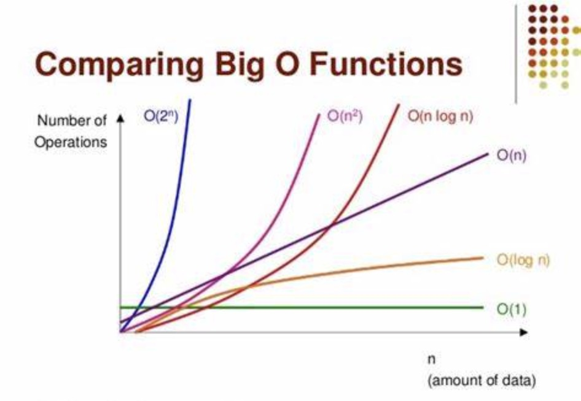

# 算法的复杂度
一个算法好不好，应该如何去评价呢？

最直观的就是看代码执行速度，比如同样去实现排序，可以用冒泡排序，也可以用快排，功能都可以实现，但是对比之下速度快的算法，便是更优的。如果说两个算法的实现速度差不多，那则还可以根据算法所占用的空间，占用空间少的是更优的，这就是算法的基础：时间复杂度和空间复杂度。

## 大O、大Ω、大θ、小o，小ω

- Ο，读音：big-oh；表示上界，小于等于。
- Ω，读音：big omega、欧米伽；表示下界，大于等于。
- Θ，读音：theta、西塔；既是上界也是下界，称为确界，等于。
- ο，读音：small-oh；表示上界，小于。
- ω，读音：small omega；表示下界，大于。

Ο是渐进上界，Ω是渐进下界。Θ需同时满足大Ο和Ω，故称为确界。Ο极其有用，因为它表示了最差性能。

### 大O表示法
大O是在分析算法复杂度时常用的一种表示法。当函数的大小只有上界，没有明确下界的时候可以使用大O表示法，该渐进描述符一般用于描述算法的**最坏复杂度**。

### 大Ω表示法
当函数的大小只有下界，没有明确上界的时候，可以使用大Ω表示法，该渐进描述符一般用于描述算法的**最优复杂度**。

### 大θ表示法
用于界定函数的渐进上界和渐进下界。当 f(n)= θ(g(n)) 的时候，代表着g(n)为f(n)的渐进紧确界。而θ渐进描述符在所有的渐进描述符中是最严格的一个，因为它既描述了函数的上界，有描述了函数的下界。

### 小o表示法
小ο表示法用于描述不能紧的上限。

### 小ω表示法
让 f(n) 和 g(n) 是将正整数映射到正实数的函数。如果对于任何实常数 c > 0，存在整数常数 n0 ≥ 1 使得 f (n) > c * g(n) ≥ 0 对于每个整数 n ≥ n0。

## 时间复杂度
要获得时间的复杂度最直观的做法是通过算法程序运行一遍即可获得，但是由于实践会受到设备环境、数据规模等因素的影响，测试算法很难得到一个标准执行时间，所以只需要找到一个评估指标，获得算法执行所消耗时间的基本趋势即可。

常见的时间复杂度量级有：
- 常数阶O(1)
- 对数阶O(logN)
- 线性阶O(n)
- 线性对数阶O(nlogN)
- 平方阶O(n²)
- 立方阶(n³)
- K次方阶O(n^k)
- 指数阶(2^n)
- 阶乘阶𝑂(n!)

上面从上至下依次的时间复杂度越来越大，执行的效率越来越低。



在大O符号表示法中，时间复杂度的公式是：T(n) = O(f(n))，其中f(n)表示每行代码执行次数之和，而O表示正比例关系，这个公式的全称是：**算法的渐进时间复杂度**。

### 常数阶O(1)
无论代码执行了多少行，只要没有循环等复杂的结构，那这个代码的时间复杂度就是O(1)：
```
const i = 1
const j = 2
++i;
j++;
```
上述代码在执行时，消耗的时间并不会随着某个变量的增长而增长，即使代码很长，有几千几万行，都可以用O(1)来表示它的时间复杂度。

### 对数阶O(logN)
> 如果 ，即a的x次方等于N（a>0，且a≠1），那么数x叫做以a为底N的对数（logarithm），记作。其中，a叫做对数的底数，N叫做真数，x叫做“以a为底N的对数”
```
let i = 1;
while(i < n)
{
    i = i * 2;
}
```
上述代码可以看到，在while循环中，每次都将i * 2，乘完之后，i距离n就越来越近了，假设循环x次后，i大于2，这个时候循环退出，可以得出2的x次方等于n，即x = log2^n，当循环log2^n次后，代码结束，因此这类代码的时间复杂度为：**O(logn)**

### 线性阶O(n)
```
for(i=1; i<=n; ++i)
{
   j = i;
   j++;
}
```
上述代码在执行时，for循环中的代码会执行n遍，因此它消耗的时间会随着n的变化而变化，这类形式的代码可以用O(n)来表示它的时间复杂度。

### 线性对数阶O(nlogN)

将时间复杂度为O(logN)的代码循环n遍，那么时间复杂度将为 n * O(logN)，也就是O(nlogN)：
```
for(m=1; m<n; m++)
{
    i = 1;
    while(i<n)
    {
        i = i * 2;
    }
}
```

### 平方阶O(n²)
平方阶O(n²)可以理解为用O(n)的代码再循环嵌套一遍，这种情况下的时间复杂度就是O(n²)了：
```
for(x=1; i<=n; x++)
{
   for(i=1; i<=n; i++)
    {
       j = i;
       j++;
    }
}
```
上述代码使用了两层for循环，它的时间复杂度就是O(n * n)，如果将其中一层循环的n改为m：
```
for(x=1; i<=n; x++)
{
   for(i=1; i<=m; i++)
    {
       j = i;
       j++;
    }
}
```
这个时候时间复杂度就变成了O(n * m)

### 立方阶O(n³)、K次方阶O(n^k)
O(n)嵌套三次即为O(n³)，嵌套k次，即为O(n^k)

### 指数阶(2^n)
```
for (int i = 0; i < 2^n; i++) {
  	n++;
}
```

### 阶乘阶𝑂(n!)
```
function a(n) {
  for (let i = 0; i < n; i++) {
    a(n - 1);
  }
}
```
循环执行次数最多的语句为`a(n - 1)`，在当前 n 下，会调用n次`a(n - 1)`，而在每个 n−1 下，又会调用n - 1次`a(n - 2)`，以此类推，得执行次数为 n×(n−1)×(n−2)×...×1，即 n!

## 空间复杂度
空间复杂度主要指执行算法所需内存的大小，用于对程序运行过程中所需要的临时存储空间的度量，同样反映的也是一个趋势。

程序执行除了需要储存空间、指令、常数、变量和输入数据外，还包括对数据进行操作的工作单元和存储计算所需要信息的辅助空间。存储空间通常包括：指令空间（即代码空间）、数据空间（常量、简单变量）等所占的固定部分和动态分配、递归栈所需的可变空间，其中可变空间和算法有关。

一个算法所需的存储空间用f(n)表示。S(n)=O(n)其中n为问题的规模，S(n)表示空间复杂度。

常见的空间复杂度量级有：
- 常数阶O(1)
- 线性阶O(n)
- 平方阶O(n²)

### 常数阶O(1)
```
let i = 1
let j = 1
```
代码中的i、j所分配的空间都不随着处理数据量变化，因此它的空间复杂度为S(n) = O(1)

### 线性阶O(n)
```
let arr = new Array(n)
```
上述代码创建了一个长度为n的数组，所分配的空间根据数组长度来决定，因此它的空间复杂度为S(n) = O(n)

### 平方阶O(n²)
```
let arr=[]
for (var i = 0; i < n; i++) {
    arr[i] = i
    for (var j = 0; i < n; i++) {
        arr[i][i] = i
    }
}
```
当用长度为n的for循环嵌套在空间复杂度为O(n)的数组上生成一个二维数组，这个时候的空间复杂度即为O(n * n)

## 总结
当对时间复杂度和空间复杂度有一定的了解后，编写代码的时候就会想到for循环的时间复杂度为O(n)，递归 + for循环的时间复杂度为O(n!)，怎样去编写更优的代码，是一条漫长的路程，丰富知识会让我们走的更远，共勉。


