# 模块化
模块化是什么，为什么需要模块化?

或许现在接触前端开发的同学对于这两个问题没有什么概念或者有概念却无从说起，但是经历过原生`javascritp`或者使用过`jquery`开发的同学应该清楚，从之前的前端文件，到现在的前端工程，之前已经发生了翻天覆地的变化，具体发生了什么呢？
## 理解模块化
### 什么是模块化
把系统分成各个独立的部分，每个部分单独实现功能，将系统分割成可独立的功能部分，每个功能部分内部实现自己相关逻辑，同时向外部暴露一些接口（方法）和其他功能模块通信。

比如一个公司，下面每一个部门都有自己的工作，财务，人事，研发等。财务需要做好自己的金额计算，同时需要提供和其他部门对接收入的功能；人事需要人员管理，负责其他部门的人员增减功能等。
每一个部门就是一个独立的模块，完成该部门下的工作任务，同时提供和其他部门协调工作的能力。

### 为什么需要模块化
最早的前端开发模式，通过手写script引入代码：
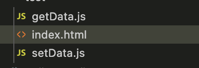

```
// getData.js
var data = "this is data"
var obj = { data: "this is data" }

// setData.js
function setData (val) {
  data = val
  obj.data = val
}

// index.html
<script src="./getData.js"></script>
<script src="./setData.js"></script>
<script>
  setData('new data') // 这个时候会改变全局的data，getData.js里面的变量被污染
</script>
```
存在问题：
1. 变量函数命名容易被覆盖，当一个团队代码过于臃肿，可能某个开发人员无意间修改了某个变量或者重新定义了一个方法，这很可怕。
2. 无法知道当前使用的变量或者函数来自于哪一个模块，所以的变量和函数都挂载在window/global上，根本无法去管理
3. 引入getData和setData的顺序不能错误，一旦错误会导致setData的`obj.data = val`执行报错

那有什么好的方法吗？

#### 命名空间
通过给变量或者函数增加命名前缀，可以实现基本的命名空间效果：
```
const dataManage = {
  data: 'this is data',
  setData (val) {
    this.data = val
  },
  getData () {
    return this.data
  },
}

dataManage.data = 'new Data' // 可以直接修改模块内部的变量
// 可以修改模块内部方法
dataManage.setData = function (val) {
  this.data = val + '-namespace'
}
```
使用命名空间后可以发现，变量和函数都挂载到了一个模块上，但是模块内部的方法和变量依旧可以被修改，因为这个模块的本质只是一个object

#### IIFE
立即调用函数表达式（英文：immediately-invoked function expression，缩写：IIFE），是一种利用JavaScript函数生成新作用域的编程方法。

立即调用函数表达式可以令其函数中声明的变量绕过JavaScript的变量置顶声明规则，还可以避免新的变量被解释成全局变量或函数名占用全局变量名的情况。
```
(function(window) {
  let data = 'this is data'

  let name = 'name'

  function getData () {
    return data
  }

  function setData (val) {
    data = val
  }

  windwo.dataManage = { getData, setData, data }
})(window)

dataManage.data = '1121' // 无法修改模块内部的 data 变量

console.log(dataManage.name) // 无法访问

console.log(dataManage.getData()) // this is data

// 可以重写该模块的方法
dataManage.getData = () => {
  return 2
}
```
IIFE通过闭包和立即执行的特性，将变量和函数包裹了起来，通过给window添加属性来对外暴露接口，这样外部只能通过暴露的接口去操作，但是问题还是没有得到解决：模块暴露的操作方法依旧可以被覆盖？

### 总结
之前的方式主要存在问题：
1. 命名冲突（即使使用了namespace也不能保证名字唯一，因为逻辑分散在各个js文件中）
2. 函数会被覆盖（我们希望的是该模块提供给其他模块的是一个调用方法，而不希望其他模块可以修改该模块内的方法）
3. 引入的时候需要严格按照依赖的顺序，否则会报错（但是碰到一些异步加载的逻辑，模块的引入会很麻烦）
4. 依赖模糊，对于开发者而言，只能看到当前引入了那些模块，但是引入的所有文件存在的关系却无法分析清楚
5. 请求过多，模块越多，需要引入的js文件就会更多
6. 引入文件过大，可能某个模块中我们只需要使用该模块的某些方法，但是只能将该js文件全部引入
7. 必须记得每一个模块中返回对象的命名才能使用
8. ...

这些问题导致开发的难以维护，使得开发人员迫切需要好的解决方案来让开发更为高效，代码依赖更为清晰，项目更加稳定，好的模块化方案在这个环境下应运而生。

## CommonJS
CommonJS是一个项目，其目标是为JavaScript在网页浏览器之外创建模块约定，并且当时被命名为ServerJS，后来为了体现它的广泛性，修改为CommonJS，平时我们也会简称为CJS。

早期Node.js在实现过程中参考了该规范，使得我们在开发node过程中可以方便进行模块化开发。

需要注意的是，在`2013年5月`，Node.js包管理器npm的作者Isaac Z. Schlueter，宣布Node.js已经废弃了CommonJS，Node.js核心开发者应避免使用它。

1. `CommonJS规范规定`
- 每一个文件就是一个模块，有自己的作用域，在一个文件里定义的变量、类、函数都是私有的，其他文件无法访问，如果希望其他文件访问，则需要定义为`global`对象的属性。
- 在模块内有一个exports对象，模块在执行时可以向其增加模块的API
- 模块必须使用exports对象作为唯一的导出方式。
- require函数接收一个模块标识符，返回外部模块导出的API。
- 在一个模块中，必须有一个自由变量module对象，module对象必须有一个id属性，这个id是模块的顶层id。

2. `CommonJS模块的特点如下`
- 所有代码都运行在模块作用域，不会污染全局作用域
- 模块可以多次加载，但是只会在第一次加载时运行一次，然后运行结果就被缓存了，以后再加载，就直接读取缓存结果。要想让模块再次运行，必须清除缓存
- 模块加载的顺序，按照其在代码中出现的顺序

`示例代码`
math.js
```
exports.add = function() {
    var sum = 0, i = 0, args = arguments, l = args.length;
    while (i < l) {
        sum += args[i++];
    }
    return sum;
};
```
increment.js
```
var add = require('math').add;
exports.increment = function(val) {
    return add(val, 1);
};
```
program.js
```
var inc = require('increment').increment;
var a = 1;
inc(a); // 2

module.id == "program";
```

### module对象
Node内部提供了一个`Module`的构建函数，所有的模块都是module的实例：
```
functon Module(id, parant) {
  this.id = id;
  this.exports = {};
  this.parent = parent;
  ...
}
```
在每个模块中，`module`自由变量是对代表当前模块的对象的引用，仅代表当前模块，常用属性有：
- module.id 模块的识别符，通常是带有绝对路径的模块文件名。
- module.filename 模块的文件名，带有绝对路径。
- module.loaded 返回一个布尔值，表示模块是否已经完成加载。
- module.parent 返回一个对象，表示调用该模块的模块。
- module.children 返回一个数组，表示该模块要用到的其他模块。
- module.exports 表示模块对外输出的值
- [更多...](https://nodejs.cn/api-v18/modules.html#the-module-object)

比如执行一个示例文件：
```
// example.js
var jquery = require('jquery');
exports.$ = jquery;
console.log(module);
```
执行这个文件，命令行会输出如下信息：
```
{ id: '.',
  exports: { '$': [Function] },
  parent: null,
  filename: '/path/to/example.js',
  loaded: false,
  children:
   [ { id: '/path/to/node_modules/jquery/dist/jquery.js',
       exports: [Function],
       parent: [Circular],
       filename: '/path/to/node_modules/jquery/dist/jquery.js',
       loaded: true,
       children: [],
       paths: [Object] } ],
  paths:
   [ '/home/user/deleted/node_modules',
     '/home/user/node_modules',
     '/home/node_modules',
     '/node_modules' ]
}
```
#### module.exports属性
CommonJS规定，模块必须使用exports对象作为唯一的导出方式。

但是Node中导出的写法却存在`exports`和`module.exprots`两种，这是因为Node中使用的是Module的实例，并且实现了module.exports对exports对象的一个引用：`module.exports = exports`。

而为什么`exports`依旧可以使用是为了方便，Node为每个模块提供一个exports变量，指向module.exports。这等同在每个模块头部，有一行这样的命令：
```
var exports = module.exports;
```

一般建议使用`module.exports`进行导出，避免出现定义的`exports`变量被覆盖，比如：
```
exports = { name: 'my name' } // 这个时候引用已经被覆盖了

modules.exports = { name: 'my name' } // 这个时候可以正常被导出
```

### require命令
Node基于CommonJS的模块规范，内置了`require`命令用于加载模块文件。

`require`命令的基本功能是，读入并执行一个JavaScript文件，然后返回该模块的exports对象。如果没有发现指定模块，会报错。

`sum.js`
```
modules.exports = function sum () {
  return 10086
}
```
`index.js`
```
const sum = require('./sum.js')
```

require的内部实现过程大概为：
```
// 定义导入类，参数为模块路径
function Require(modulePath) {
    // 获取当前要加载的绝对路径
    let absPathname = path.resolve(__dirname, modulePath);
    // 创建模块，新建Module实例
    const module = new Module(absPathname);
    // 加载当前模块
    tryModuleLoad(module);
    // 返回exports对象
    return module.exports;
}
```
#### 加载规则
`require`命令用于加载文件，后缀默认为`.js`，并且根据参数的不同格式，`require`命令去不同路径下面寻找模块文件：
1. 如果参数字符串以 **"/"** 开头，则表示加载的是一个位于绝对路径的模块文件，比如`require('/package/jquery.js')`将加载`/package/jquery.js`
2. 如果参数以 **"./"** 开头，则表示加载的是一个和当前执行文件相比位于相对路径的模块文件，比如`require('./babel')`则加载到当前目录下的`babel.js`文件
3. 如果参数字符串不以 **./** 或者 **/** 开头，则表示加载的是一个默认提供的核心模块。位于Node的系统安装目录中，或者在`node_modules`目录的已安装模块，比如脚步`/coding/work/projects/init.js`执行了`require('route.js')`命令，node会依次搜索下面的文件：
  -/usr/local/lib/node/route.js
  -/coding/work/projects/node_modules/route.js
  -/coding/work/node_modules/route.js
  -/coding/node_modules/route.js
  -/node_modules/route.js
4. 如果参数字符串不以 **./** 或者 **/** 开头，而是一个路径，比如`require('babel/core')`，则先找到`babel`的位置，然后再以它为参考找到后续路径
5. 如果指定的模块文件没有发现，Node会尝试为文件名添加`.js`、`.json`、`.node`后再去搜索。`.js`文件会以文本格式的JavaScript脚本文件解析，`.json`文件会以JSON格式的文本文件解析，`.node`文件会以编译后的二进制文件解析。
6. 如果想得到`require`命名加载的确切文件名，使用`require.resolve()`方法。
#### 目录的加载规则
node工程中，会把相关文件放在一个目录下，方便组织。这个时候最好为这个目录设置一个入口文件，让`require`方法可以通过这个入口文件加载整个目录。
在目录中放置一个`package.json`文件，并且将入口文件写入`main`字段。

`require`发现参数字符串指向一个目录以后，会自动查看该目录的`package.json`文件，然后加载`main`字段指定的入口文件。如果`package.json`文件没有main字段，或者根本就没有`package.jso`n文件，则会加载该目录下的`index.js`文件或`index.node`文件

```
// package.json
{ "name" : "some-library",
  "main" : "./app.js" }
```

#### 模块的缓存
模块中第一次加载某个模块的时候，Node会缓存该模块，再次加载该模块的时候就直接从缓存中取出该模块的`module.exports`属性。
```
require('./example.js');
require('./example.js').message = "hello";
require('./example.js').message // 期待 undefined 得到的是 "hello"
```
上面代码中，连续三次使用`require`命令，加载同一个模块。第二次加载的时候，为输出的对象添加了一个`message`属性。但是第三次加载的时候，这个`message`属性依然存在，这就证明`require`命令并没有重新加载模块文件，而是输出了缓存。

在某些情况下，希望多次执行该模块，可以让该模块输出一个函数，然后每次`require`这个模块的时候都会重新执行一次：
```
modules.export = (function () {})()
```

所以缓存的模块都保存在`require.cache`中，如果想删除模块的缓存，则可以这样去实现：
```
// 删除指定模块的缓存
delete require.cache[moduleName]

// 删除所有模块的缓存
Object.keys(require.cache).forEach(function(key) {
  delete require.cache[key];
})
```

需要注意的是，缓存是根据绝对路径识别该模块的，如果同样的模块名，但是保存在不同的路径，`require`命令还是会重新加载该模块。

#### 模块的循环加载
如果发生模块的循环加载，即A加载B，B又加载A，则B将加载A的不完整版本：
```
// a.js
exports.x = 'a1';
console.log('a.js ', require('./b.js').x); // a.js  b2
exports.x = 'a2';

// b.js
exports.x = 'b1';
console.log('b.js ', require('./a.js').x); // b.js  a1
exports.x = 'b2';

// main.js
console.log('main.js ', require('./a.js').x); // main.js  a2
console.log('main.js ', require('./b.js').x); // main.js  b2
```
当多次执行a.js和b.js的时候，会直接从缓存读取exports属性，所以a.js和b.js内部的console.log语句都不会执行了

### 模块的加载机制
CommonJS模块的加载机制是，输入的是被输出的值的拷贝，一旦输出值，模块内部的变化就影响不到这个值。

`a.js`
```
var obj = { name: 'name', age: 99 }

var num = 10

function getObj () {
  console.log(obj)
}

function setnum (val) {
  num = val
}

module.exports = {
  obj,
  num,
  setnum,
  getObj
}
```

`b.js`
```
const { obj, num, getObj, setnum } = require('./1')

obj.age = 111

getObj() // { name: 'name', age: 111 }
setnum(111)
console.log(num) //
```
上面代码说明，numr输出以后，bjs模块内部的变化就影响不到num了，不过引用类型的数据依旧可以被修改

#### require的内部处理流程
`require`命令是CommonJS规范中用来加载其他模块的命令。它并不是一个全局命令，而是指向当前模块`module.require`命令，而后者又会调用Node内部命令`Module._load`：
```
Module._load = function(request, parent, isMain) {
  1. 检查Module._cache是否缓存当前模块
  2. 如果缓存没有，就创建一个新的Module实例
  3. 将它保存到缓存
  4. 使用module.load()加载指定的模块文件，读取文件内容之后，使用module.compile()执行文件代码
  5. 如果加载/解析过程出错，就从缓存中删除该模块
  6. 返回该模块的module.exports
}
```
`module.compile()`做了这些事情：
```
Module.prototype._compile = function(content, filename) {
  // 1. 生成一个require函数，指向module.require
  // 2. 加载其他辅助方法到require
  // 3. 将文件内容放到一个函数之中，该函数可调用 require
  // 4. 执行该函数
};
```
`require`函数及其辅助方法主要如下：
- require(): 加载外部模块
- require.resolve()：将模块名解析到一个绝对路径
- require.main：指向主模块
- require.cache：指向所有缓存的模块
- require.extensions：根据文件的后缀名，调用不同的执行函数

一旦`require`函数准备完毕，整个所要加载的脚本内容就会放到一个新的函数中，这样可以避免污染全局环境，这个函数的参数包括`require`、`module`、`exports`以及一些其他参数：
```
(function (exports, require, module, __filename, __dirname) {
  ...
});
```
`Module._compile`方法是同步执行的，所以`Module._load`要等它执行完成才会向用户返回`module.exports`的值。

### 优缺点
- 优点
1. 服务器端模块便于重用
2. NPM中有很多可以使用的模块包
3. 简单易用
4. js代码执行顺序清晰，可控

- 缺点
require的加载是同步执行的，不能并行加载多个模块。require通过调用`Module._load`去加载模块并复制到新的函数返回，在服务端是可以正常运行的，但是不适合在浏览器环境，浏览器资源是异步加载的，需要并行加载多个资源。

## AMD
有了服务端模块以后，开发者希望客户端也能实现模块化，而且最好两者可以兼容，一个模块都不能修改，在服务端和浏览器端都可以去运行。在浏览器端的模块不能采用`同步加载`，只能用`异步加载`的背景下，AMD规范诞生了。

目前有两个主要的Javascript库实现了AMD规范：[`require.js`](https://requirejs.org/)和[`curl.js`](https://github.com/cujojs/curl)。

`AMD`是"Asynchronous Module Definition"的缩写，意思就是“异步模块定义”，它采用异步方式加载模块，模块的加载不影响它后面语句的运行，所有依赖这个模块的语句都定义在一个回调函数中，等到加载完成之后，这个回调函数才会运行。

### define
AMD规范简单到只有一个API，就是define函数：
```
define([module-name?], [array-of-dependencies?], [module-factory-or-object])
```
- module-name：模块标识，可以省略
- array-of-dependdencies：所依赖的模块，可以省略
- module-factory-or-object：模块的实现，或者一个JavaScript对象

`define`函数的第一个参数和第二个参数都是可以省略的，第三个参数则是模块的具体实现，在不同的场景下可以使用不同的参数组合。

1. `场景一`：一个模块内定义其他模块，比如定义了一个alpha模块，并且依赖于内置的require，exports模块，以及外部的beta模块：
```
defind('alpha', ['require', 'exports', 'beta'], function(require, exports, beta) {
  exports.verb = function () {
    return beta.verb()
  }
})
```
2. `场景二`：定义当前文件为一个模块，可以使用匿名模块，省略第一个参数的时候，当前模块文件名就是模块标识：
```
// 当前文件为a.js， 模块名被省略了，不省略的话为define('a', ['alpha'], function (alpha) {})

define(['alpha'], function (alpha) {
  ...
})
```
3. `场景三`：定义当前文件为一个模块且不依赖其他模块，可以定义为JavaScript对象或一个函数，这个情况下可以省略`define`的前两个参数：

比如定义为对象，该模块的作用可以是一个数据模块：
```
define({
  menuName: '系统管理',
  menuPath: '/sys',
  children: [
    {
      menuName: '用户管理',
      menuPath: '/user',
    },
    {
      menuName: '角色管理',
      menuPath: '/role',
    },
    ...
  ],
  ...
})
```
比如定义为函数，该模块的作用可以是一个工具类：
```
define(function () {
  const loadsh = require('loadsh')
  return function (val) {
    if (!val || typeof val !== 'object') return
    return loadsh.add(val, 10)
  }
})
```

#### define的内部处理流程
当模块的实现是函数的时候：
1. 判断是否存在依赖模块，存在则等待依赖模块都加载完成后调用函数，加载的模块会以参数的形式传入该函数。
2. 当省略了模块名以及需要依赖的模块，define方法在执行的时候会调用函数的toString方法，并且扫描其中的require调用，提前载入这些模块，载入完成之后再执行。（需要考虑浏览器对函数toString方法的兼容问题，如果是build后的工程则不用考虑）

### 优缺点
- 优点
  1. 可以在浏览器环境中异步加载模块，可以并行加载多个模块
  2. 可以很好的处理模块之间的依赖关系，使得模块逻辑有序的执行
- 缺点
  1. 提高了开发成本，代码的阅读和书写比较困难，AMD模块规范的语法不够简洁
  2. 不能按需加载，需要提前加载所有的模块
  3. 并行加载，异步处理不能保证加载的顺序，存在隐患
  4. 难以支持模块静态分析

## CMD
`CMD`的全称是`Common Module Definition`，即通用模块定义，其提供了模块定义和按需加载执行模块。该规范明确了模块的基本书写格式和基本的交互规则。该规范是国内大牛玉伯在开发[`SeaJS`](https://github.com/seajs/seajs)的时候提出来的，属于CommonJS的一种规范，根据浏览器的异步环境做了自己的实现。它和 AMD 很相似，尽量保持简单，并与 CommonJS 和 Node.js 的 Modules 规范保持了很大的兼容性。

### define
在`CMD`中，一个模块就是一个文件，define是一个全局函数，用来定义模块。
```
define(factory)
```
和AMD的define区别主要在：CMD推崇依赖就近原则，所以不在define的参数中写依赖，而在`factory`中写。
### factory
`factory`参数可以是一个函数，也可以是一个对象或者字符串：

参数为对象或者字符串时，表示该模块就是该对象或者字符串：
```
define({ type: 'CMD' })
define('this is CMD')
```
当factory为函数时，此函数就是模块的构造方法，该函数默认提供`require`、`export`、`module`：
```
define(function(require,exports,module){

})
```
#### require
`require`是`factory`函数的第一个参数，它是一个方法，接受模块标识作为唯一参数，用来加载其他模块。

- 同步加载时，直接调用`require`：
```
define(function(require,exports,module){
  // 加载模块a
  const a = require('./a')
  // 调用a
  a()
})
```
- 异步加载时，使用`require.saync`方法：
```
define(function(require, exports, module) {
  require.async('./a', function (a) {
    a()
  })
})
```
- 获取模块路径，使用`require.resolve`：
```
define(function(require, exports, module) {
  require.resolve('./a') // /work/coding/CMD/module/a.js
})
```

### exports和module
CMD是基于CommomJS的规范，exports和module的实现基本一致：
```
define(function(require, exports, module) {
  exports.name = 'CMD'
  module.exports.age = 10
  ...
})
```
### 优缺点
- 优点
  1. 依赖就近，编写的时候模块中依赖的应用范围清晰
  2. 大程度兼容CommonJS，适合在服务端运行
- 缺点
  1. 语法复杂
  2. 依赖加载器，需要SPM进行打包
  3. 难以支持模块静态分析
  4. 依赖关系不直观，无法清晰知道当前模块依赖了哪些模块

## UMD
`UMD` (Universal Module Definition)，是一种javascript通用模块定义规范，让你的模块能在javascript所有运行环境中发挥作用。

### 兼容各种规范
- CommonJS写法：
```
if (typeof module === 'object' && typeof module.exports === 'object') {
  const a = require('a')
  const b = require('b')
  module.exports = {
    a, b
  }
}
```

- AMD写法：
```
if (typeofof define === 'function' && define.amd) {
  define(['a', 'b'], function (a, b) {
    return {
      a, b
    }
  })
}
```

- CMD写法：
```
if (typeofof define === 'function' && define.cmd) {
  define(function (equire, exports, module) {
    const a = require('a')
    const b = require('b')
    module.exports = {
      a, b
    }
  })
}
```

### 实现UMD模块
```
(function(window, cb) {
  // CommonJS
  if (typeof module === 'object' && typeof module.exports === 'object') {
    module.exports = factory()
    return
  }
  // AMD
  if (typeofof define === 'function' && define.amd) {
    define(['depModule'], factory())
    return
  }
  // CMD
  if (typeofof define === 'function' && define.cmd) {
    define(function (equire, exports, module) {
      module.exports = cb()
    })
    return
  }
  // 没有模块环境
  this[moduleName] = cb()
})(window, function(arg) {
  ...
})
```

### 优缺点
- 优点：兼容了各种规范，实现了通用的平台方案
- 缺点：写法麻烦，是一种妥协的方案

## ES Module
在`ES6`之前，社区定义了一些模块加载方案，主要是`CommonJS`、`AMD`、`CMD`，`
Node对CommonJS进行了实习，RequireJS对AMD进行了实现，seaJS对CMD进行了实现。

`ES6`引入了模块化，其设计思想是尽量的静态化，使得编译时就能确定模块之间的依赖关系，以导入和导出的变量，其一个模块就是一个独立的文件，该文件内部的所有变量外部无法获取，只能通过模块提供的命令去操作。

模块功能主要由两个命令构成：`export`和`import`。`export`命令用于规定模块的对外接口，`import`命令用于输入其他模块提供的功能。

### export

- `export`导出的是值的引用，当模块内部值发生改变外部获取到的会是改变后的值。
- `export`命令可以出现在模块的任何位置，但是必须处于模块的顶层，不能在块级作用域中，因为一旦这样做了，一旦处于条件代码中是无法做静态优化的，这违背了`ES6`模块的设计初衷（`import`命令也是如此）。
#### export导出的几种场景
1. 导出变量
```
export const name = 'ES module'
export const type = 'module'
```
不同的写法：
```
const name = 'ES module'
const type = 'module'

export { name, type }
```

2. 导出函数
```
export function add () {
  ...
}
```
使用`as`关键字重命名：
```
function add () { ... }
function float () { ... }

export {
  add as addFn,
  add as computedFn,
  float as floatFn
}
```
使用`as`关键字重命名后，`add`函数可以用不同的名字导出多次。

3. 导出`export default`
使用`export default`命令默认导出，且一个模块只能有一个默认导出值：
```
// 导出匿名函数
export default function () { ... }
```
```
// 导出函数
export default function add () { ... }
```
`export default`命令导出的是一个`default`变量，所以后面不能跟着变量声明语句，可以导出匿名函数，函数声明或者变量名。

4. 导出多个值和`export default`

```
export const name = 'ES module'
export const type = 'module'
export default function () { ... }
```

5. 导出当前`import`模块
导出当前导入的模块：
```
export { add, age } from 'my_module';

// 等同于
import { add, age } from 'my_module';
export { add, age };
```
`import * as moduleName`语法可以直接导入所有导出的模块，这个时候通过`export`将所有模块导出：
```
export * as a from "./a.js"

// 等同于
import * as a from "./a.js
export { a }
```


### import
使用`export`命令定义了模块的对外接口后，其他JS文件就可以通过`import`命令加载这个模块。
#### import导入的几种场景
1. 导入整个模块
```
import * as a from './a.js'
```
`as`关键字可以为当前输入接口重新命名，`import * as moduleName`语法可以直接导入所有导出的模块并以该模块名作为命名空间，例如上面的导入模块中包含`add`方法，`age`属性，则可以这样进行调用：
```
a.add(a.age)
```

2. 导入单个接口
```
import { add } from './a.js'
```

3. 导入多个接口
```
import { add，age } from './a.js'
```

4. 导入带有别名的接口
```
import { add ad addFn，age } from './a.js'
```

5. 仅作为副作用导入一个模块
整个模块仅为副作用（中性词，无贬义含义）而导入，而不导入模块中的任何内容（接口）。这将运行模块中的全局代码，但实际上不导入任何值。
```
import './a.js'
```

6. 导入默认值
需要从引入模块中导入默认值时：
```
import a from './a.js';
```
也可以同时将`default`语法和其他用户一起使用：
```
import a, { add, age } from './a.js';
```
#### import的只读
`import`命令输入的变量都是只读的，因为它的本质是输入接口：
```
import { a } from './a.js'

a = {} // // Syntax Error : 'a' is read-only;
```
但是当输入的变量是一个对象，去改写对象的属性是可以的：
```
import { a } from './a.js'

a.name = 'es module'
```
这个时候其他模块去读取`a`的时候也可以读取到修改后的`name`属性，这种操作往往容易引起弊端，所以一般输入的变量，都只做为只读，不要去修改。

#### import()
标准用法的`import`导入模块是静态的，有利于编译器提高效率，但也导致无法在运行时加载模块，比如node的`require`方法：
```
const path = './' + fileName
const myModule = require(path)
```
在运行过程中，可以动态去加载当前逻辑下需要的模块。意识到这个问题，在[**ES2020提案**](https://github.com/tc39/proposal-dynamic-import)引入了`import()`函数，支持动态加载模块。

`import()`返回一个Promise对象，可以使用`then()`方法处理，也可以使用`await`命令，返回的是该模块的输出信息：
```
function getRouter () {
  ...
  const routeItem = await import(routeName)
  console.log(routeItem) // { default } default 是routeName.js的输出接口
  ...
}
```
`import()`的一些适用场合：
1. 按需加载，在需要的时候再通过`import()`去加载某个模块，比如组件的按需加载，地图插件的加载等
2. 条件加载，根据不同的情况加载不同的模块，比如不同逻辑需要加载不同的插件。
3. 动态的模块路径加载，常见场景有在管理后台的动态菜单生成等权限相关的功能。


### 模块的继承
```
// b.js
export * form 'lodash'

export const a = 'a'
```
相当于
```
import * form 'lodash'

export *

export const a = 'a'
```
上面代码中的`export *`，将`lodash`模块中所有输出引入到`b.js`中，然后再次导出，调用`b.js`模块的文件可以直接使用到`lodash`中导出的方法：
```
import { a, each, forEach } from './b.js'
```
### ES module原理
`ES Module`主要分为三个阶段：
1. 构建：
  - 模块定位：确定要从哪里下载包含该模块的文件
  - 提取文件，通过从URL下载或者从文件系统加载
  - 解析文件为模块记录
2. 实例化：为所有模块分配内存空间（这时还没有填充值），然后依照导出、导入语句把模块指向对应的内存地址。这个过程称为**链接（Linking）**。
3. 运行：运行代码，从而把内存空间填充为真实值。
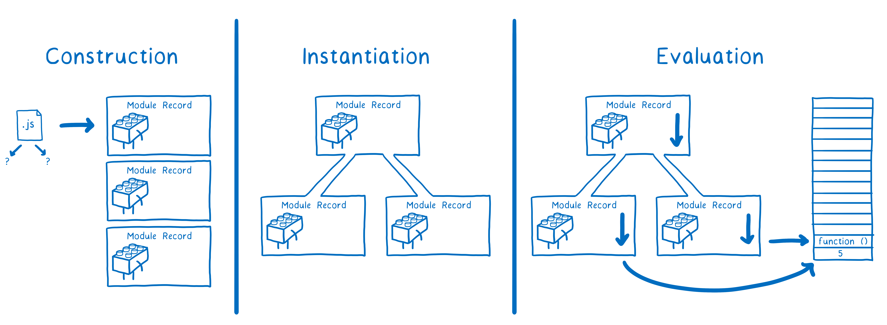

常说`ES Module`是异步加载的原因是因为这三个步骤可以相互独立运行，但是也可以同步去执行，这主要取决于它的运行环境。`ESM`标准并没有明确规范所有的相关内容，因为这些工作分为了两部分，并且分别是由不同的标准去定义的。

`ESM`标准规范了如何把文件解析为模块记录，如何实例化和如何运行模块，但是没有规范如何获取文件。

文件是由加载器来获取的，而加载器由另外一个标准所规范。对于浏览器来说，这个标准就是`HTML`，而在不同的平台加载器也不同。


加载器也同时控制着如何加载模块，它会调用`ESM`的`ParseModule`、`Module.Instantiate` 和 `Module.Evaluate`等方法，去控制JS引擎。
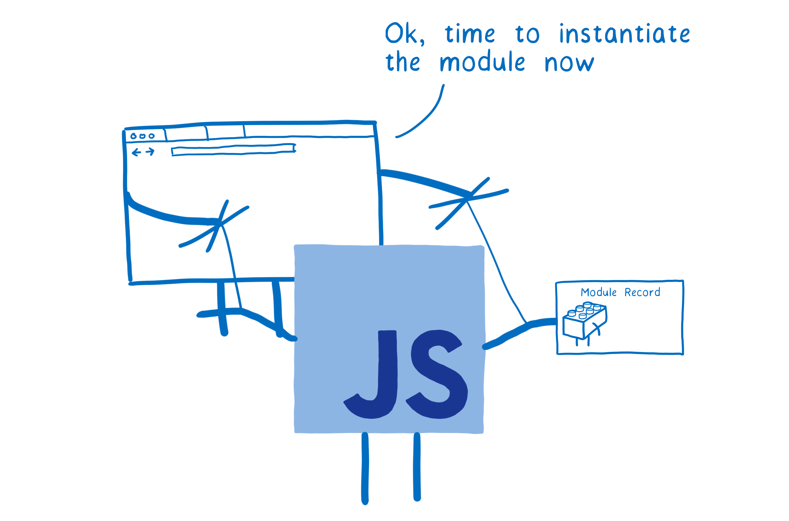

<!-- 1. 构建依赖关系图

当使用ES Module进行开发时，会对模块进行静态分析，这个过程其实就是在加载阶段得到**模块的依赖关系图**，浏览器或者Node会从指定的入口文件开始，顺着导入语句找出所依赖的其他代码文件。
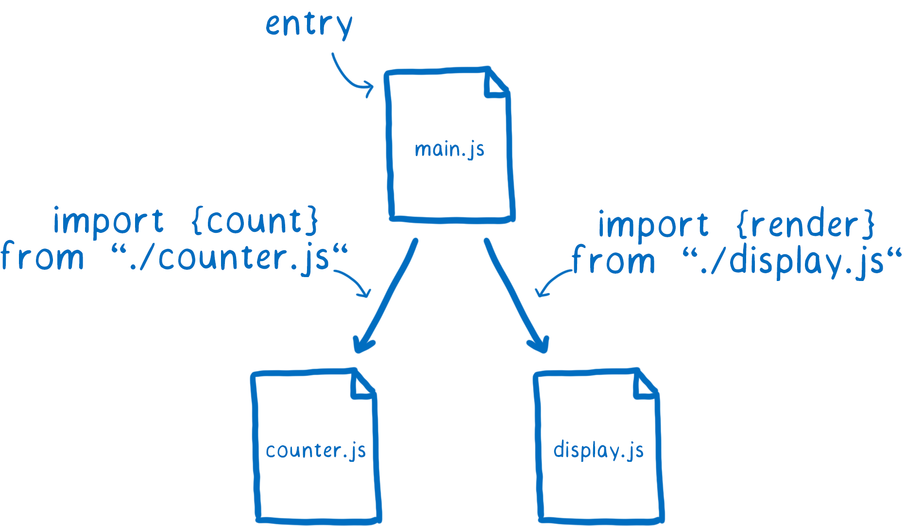

2. 生成 Module Record

浏览器无法直接使用文件本身，但是浏览器会解析这些文件，根据import/export语句构成模块记录（Module Record），每个模块文件对应一个Module Record，记录当前模块的信息。
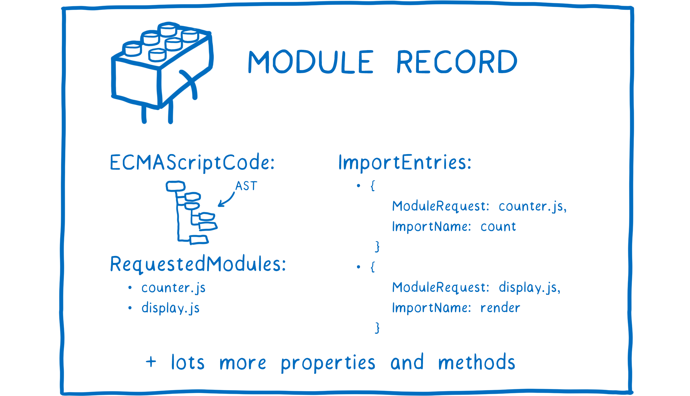

3. 转换为 Module Instance

解析之后，还需要把模块记录编程一个模块实例（Module Instance），模块实例里面会把代码和状态结合在一起。

**代码**，实际上就是一组指令集合，比如`export`、`export default`、`as`等，这些指令告诉你怎样去进行操作。

**状态**，则就是变量，对值的引用，内存是存储这些值的地方。
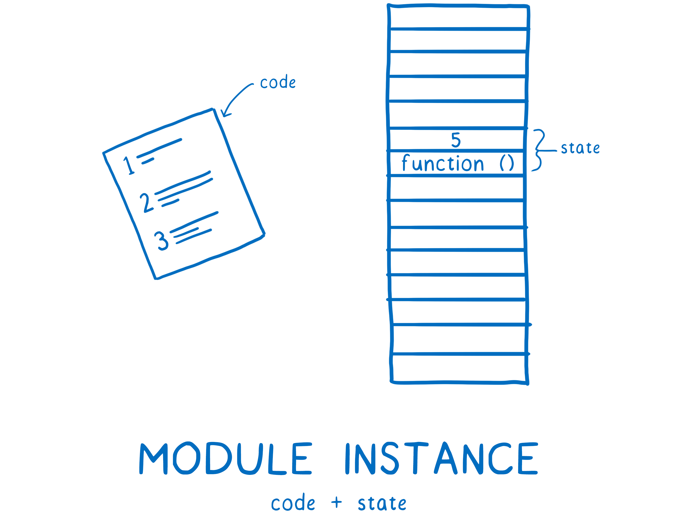

对于模块而言，我们最终需要的是模块实例，模块加载会从入口文件开始，得到模块记录，最终生成完整的模块实例关系图。 -->
#### 构建
1. 构建关系图

加载器主要负责的是定位文件并且提取，所以需要找到入口文件。在HTML中，可以通过`<script>`标签来告诉加载器。
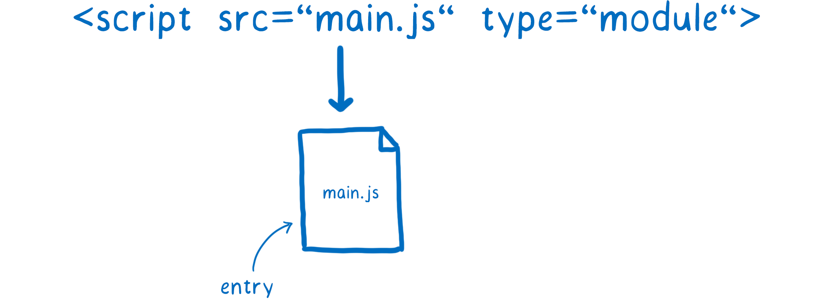

当已经知道`main.js`是入口文件后，加载器会进一步去定位该文件下依赖的模块。主要通过的是`import`导入语句，该语句上有一部分称为**模块定位符（Module Specifier）**，它会告诉加载器去哪定位模块。
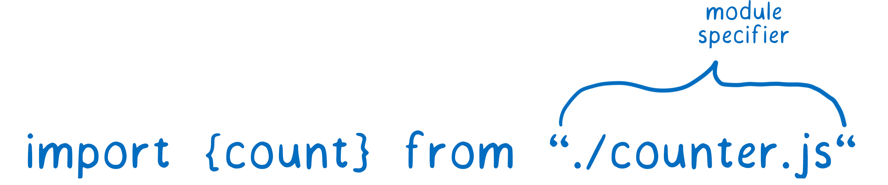

需要注意的是，在浏览器和Node中对于**模块定位符**有不同的处理方式。实际上每个平台都有自己的一套方式来解析模块定位符，这些方法称为**模块定位算法**。

而浏览器上只接收**URL**作为模块定位符，加载到对应文件后，会先解析文件，然后找到依赖，最后再次定位并加载这些依赖，循环反复，生成一颗依赖树。


<!-- 如果主线程正在等待这些模块文件下载完成，许多其他任务将会堆积在任务队列中，造成阻塞，因为在浏览器中，下载可能会耗费大量的时间。
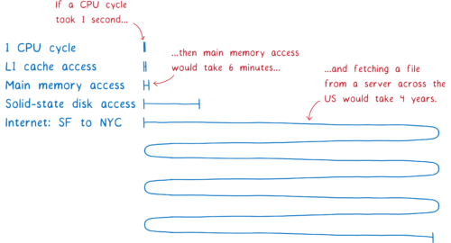 -->

<!-- 而阻塞时间过长会使得浏览器卡顿，白屏，影响用户体验，所以这也是`ESM`把加载步骤分为了多个可以独立运行步骤的原因之一，因为将构建分为了一个独立阶段后，浏览器可以在进入同步的实例化过程之前下载文件然后理解模块关系图。 -->

2. 提取文件

当加载器要从一个URL加载文件时，它会把URL记录到`模块映射（Module Map）`中，`模块映射`使用加载器用来管理缓存，每个全局作用域中都在一个单独的模块映射跟踪其模块。

当加载器要从一个URL加载文件时，它会把URL记录到模块映射中，并把它标记为正在下载的文件，同时发出这个文件的请求并继续开始获取下一个文件。
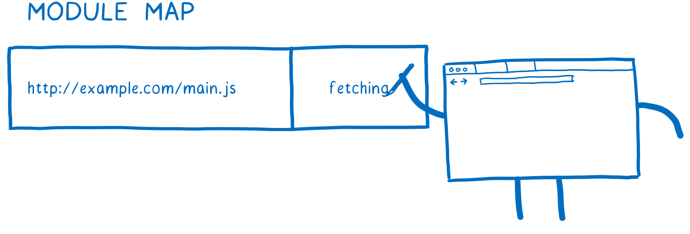

如果存在其他模块也依赖这个文件，加载器会查找模块映射中该URL状态，如果发现URL已经下载完成或者正在下载，则会跳过该URL开始下一个依赖的处理。

3. 解析为模块记录

通过构建模块依赖图并且加载文件后，浏览器并不能直接使用这些代码，所以ESM需要先将对应文件解析为模块记录获取到文件内部的具体信息。


模块记录创建完成后，它会被记录在模块映射中，后续任何时候再次请求这个模块时，加载器可以直接从模块映射中获取该模块。
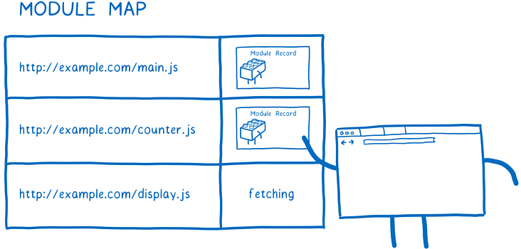

当构建阶段完成后，将会得到一堆模块记录。
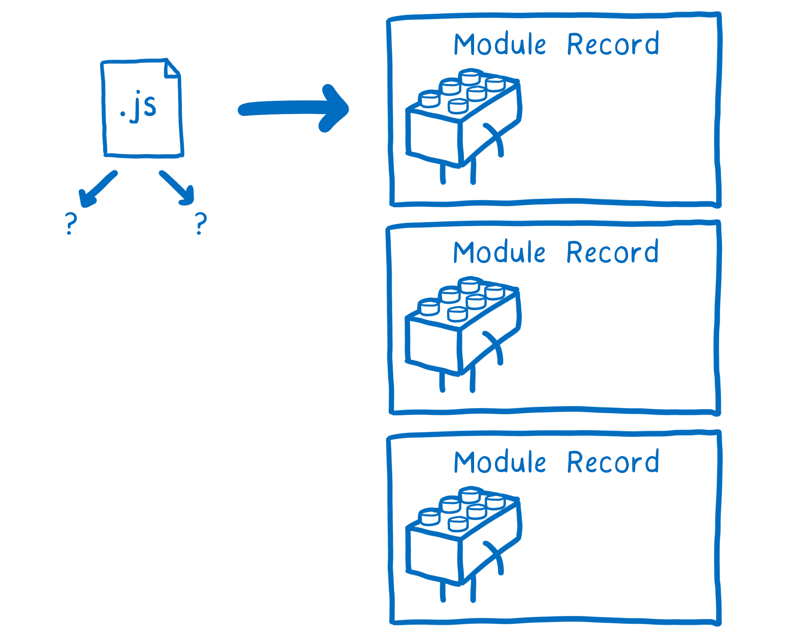

#### 实例化
模块实例会把代码和状态结合起来，状态储存在内存中，所以实例化的过程就是把所有值写入内存的过程。

其中**代码**指的是`export`等操作命令。**state**则是存储着对应导出模块的真实内存地址


整个过程如下，首先，JS引擎会创建一个`模块环境记录(Module Environment Record)`，它管理着模块记录的所有变量，然后引擎会找出导出在内存中的地址，模块环境记录会跟踪每个导出对应哪个内存地址。

这些内存地址此时还没有值，需要等到运行后它们才会被填充上实际值，不过所有导出的函数声明都在这个阶段初始化了。

为了实例化模块关系图，引擎会使用**深度优先的后序遍历方式**，即它会顺着关系图到达最底端没有任何依赖的模块，然后设置它们的导出。
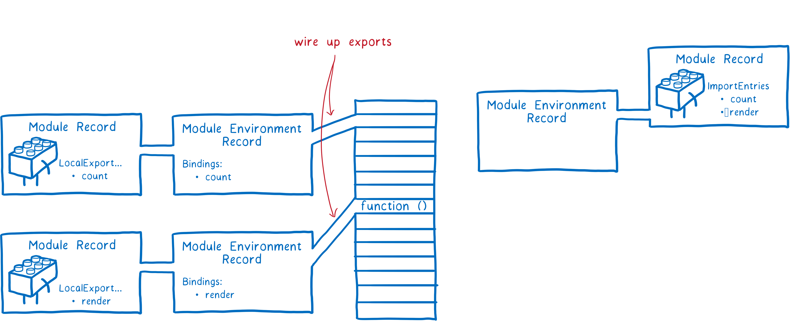

最终引擎会把模块下的所有依赖导出链接到当前模块，然后回到上一层把模块的导入链接起来。
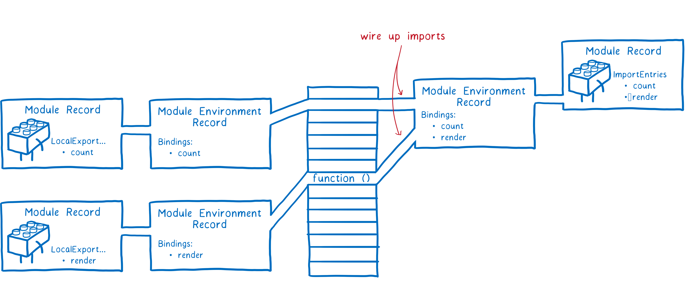

#### 运行
这个步骤需要往已经存在的内存空间内填入真实值，JS引擎会通过运行顶层代码（函数外的代码）来完成填充。
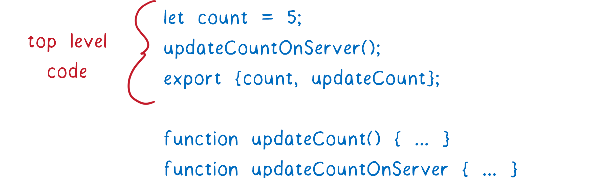

但是运行代码除了填充值以外，也会引发一些副作用，比如一个模块可能向服务端发起请求，模块中函数运行会修改变量等。为了避免这些问题的存在，模块的代码只会运行一次，这也是为什么使用模块映射的原因之一。模块映射通过URL索引来缓存模块，以确保每个模块只有一个记录，这也保证了这个模块只会运行一次。

### 优缺点
- 优点
  1. ECMAScript6版本开始支持`module`
  2. 支持模块静态化分析，能在编译时确定模块之间的依赖关系
  3. 语法简洁，语义清晰
  4. 支持循环依赖（通过模块映射，只有有一个模块记录且变量都指向内存）
- 缺点

  [浏览器兼容问题](https://caniuse.com/?search=es%20module)，需要担心一些还在使用的老版本和IE。
  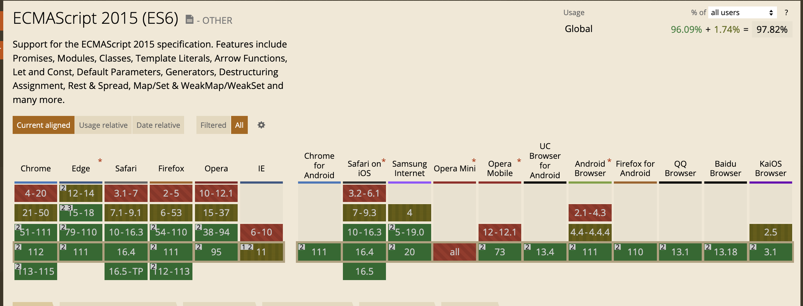
  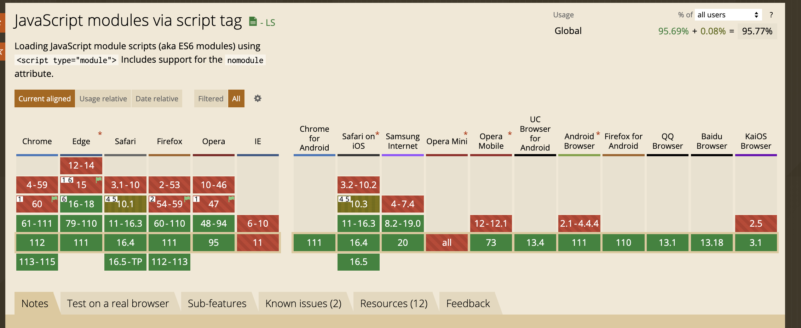


## 总结
前端模块化的过程经历了很多，`ES Module`在实现了模块功能的前提下，也实现的相当简单，经历了一些Node和浏览器版本的迭代，目前已经完全取代CommonJS和AMD规范，成为了浏览器和服务端通用的解决方案。
