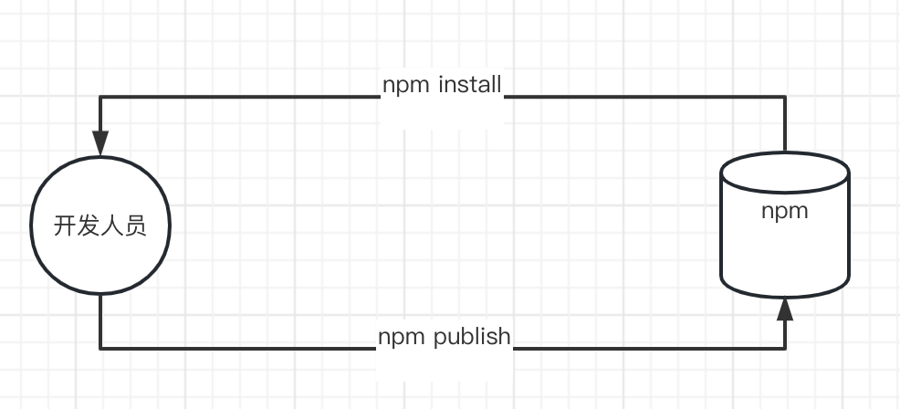
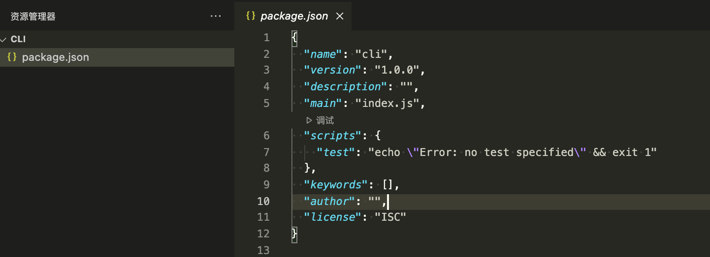

# npm

## npm是什么
npm的全称是Node Package Manager，是一个NodeJS包管理和分发工具，已经成为了非官方的发布Node模块（包）的标准。

npm由三个不同的组件组成：
- [网站](https://www.npmjs.com/)（查找npm包、设置配置文件和管理npm体验的地方）
- 用于发布和下载程序的[CLI](https://nodejs.cn/npm/cli/v8/commands/npm/)（命令行界面）工具
- [注册表](https://nodejs.cn/npm/cli/v8/using-npm/registry/)


<!-- 开发人员和npm的关系我们可以理解为：
 -->

## package.json
每个JavaScript项目都可以被当作npm软件包，并且通过package.json来描述项目和软件包的信息，所以package.json是工程化项目必要的一个部分。

当使用`npm init`初始化JavaScript/Node.js项目的时候，会自动生成该文件：


主要属性：
- name：项目或者库的名称
- version：项目的版本
- description：项目的描述
- main：项目入口文件
- scripts：
- author：项目作者
- license：项目的许可证
- dependencies：生产环境需要的依赖，比如vue，vue-router，这些被编译后依旧需要引入才能项目才能运行的依赖
- devDependencies：开发环境需要的依赖，比如babel，eslint，husky等工具
- ...
- [查看全部](https://nodejs.cn/npm/cli/v9/configuring-npm/package-json/)

### package-lock.json
对于npm修改node_modules树或package.json的任何操作，都会自动生成package-lock.json。它描述了生成的确切树，以便安装能够生成相同的树。
比如我们设置版本为:

```
"lint-staged": "^13.1.2"
```
当前安装的时候 13.1.2为最高版本，则在package-lock.json中生成以后，后续安装都会根据package-lock.json中的版本进行安装，如果需要安装最新版本则需要删除package-lock.json文件重新进行安装。

package-lock.json旨在提交到代码库中，并用于各种目的：
- 描述依赖关系树的单一表示，以保证团队成员、部署和持续集成安装完全相同的依赖关系。
- 为"time-travel"的用户提供一种工具，使其无需提交目录本身即可进入node_modeles的先前状态
- 通过可读的源代码控制差异促进树变化的更大可见性
- 通过允许npm跳过以前安装的包的重复元数据解析来优化安装过程。


## 发布到npm

发布一个npm包应当遵循以下的步骤：
1. 创建好你的项目
    - npm init/npm init -y 初始化项目
    - 配置好package.json文件
    - 配置好你的入口文件
    - 编写完成你的项目相关代码
    - 创建一个README.md文件描述你的项目内容
2. [账号注册](https://www.npmjs.com/signup)（如果没有需要注册，已经有账号则直接到第三步）
3. 登陆npm（npm login）

4. 发布包（npm publish）

5. 删除包（npm unpublish <包名> -fource）

删除时需要注意的问题:
1. npm unpublish 只能删除`72小时以内`发布的包
2. npm unpublish 删除的包，在`24小时内`不允许重复发布
3. 发布包的时候需要慎重，尽量不要发布没有意义的包

### 发布常见问题

1. 提示没有权限

```
403 Forbidden - PUT https://registry.npmjs.org/package-name - You do not have permission to publish "package-name". Are you logged in as the correct user?
```

这种一般是这个包名已经存在，去npm官网搜一下想要创建的名字，不存在的话则可以发布成功

2. 需要登陆

```
npm ERR! code ENEEDAUTH
npm ERR! need auth auth required for publishing
npm ERR! need auth You need to authorize this machine using `npm adduser`
```

后面已经注明了，输入npm adduser重新登录就可以了，过程和npm login一样，这个问题在你切换了 npm 源之后或登录过期后都有可能发生

3. 只有管理员才有权限发布

```
npm ERR! publish Failed PUT 403
npm ERR! code E403
npm ERR! [no_perms] Private mode enable, only admin can publish this module [no_perms] Private mode enable, only admin can publish this module: your-package
```

这个是你的源设置成第三方源的时候才有可能发生，比如设置了淘宝源就可能会导致该问题。只要把源改回默认的就可以了，如下：

```
npm config set registry http://registry.npmjs.org
```

4. 无法发布到私有包

```
npm ERR! publish Failed PUT 402
npm ERR! code E402
npm ERR! You must sign up for private packages :
```

这个当你的包名为@your-name/your-package时才会出现，原因是当包名以@your-name开头时，npm publish会默认发布为私有包，但是 npm 的私有包需要付费，所以需要添加如下参数进行发布:

```
npm publish --access public
```
