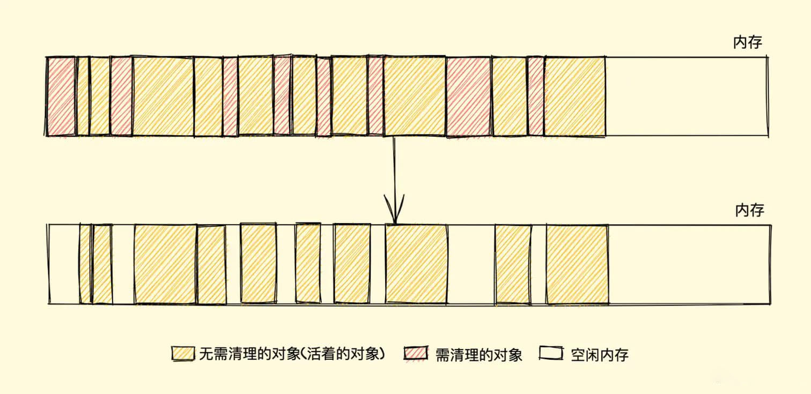
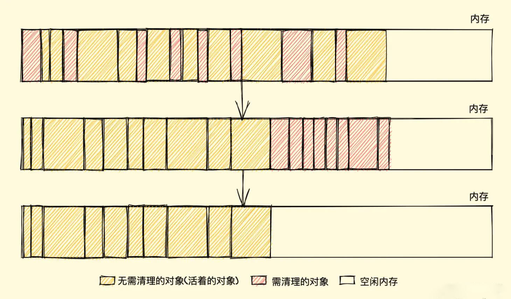

# 垃圾回收
## 垃圾产生和回收
编写代码时，创建一个基本类型、对象或者函数等都是需要占用内存的，只不过这些内存引擎已经帮我们分配好了，我们不需要显式的去分配内存。

但是如果程序运行后内存一直在增加，对系统的性能会造成很大的影响，甚至会造成进程的奔溃，所以对于持续运行的服务进程，除了分配内存外同样需要将不再使用的变量进行释放，也就是**垃圾回收**。

## 垃圾回收策略
Javascript中内存管理的主要概念是**可达性**，即那些以某种方式可访问或者说可用的值，它们被保证存储在内存中，反之不可以访问则需回收。

1. 有一组基本的固有可达值，由于显而易见的原因无法删除，这些值称为根：
  - 本地函数的局部变量和参数
  - 当前嵌套调用联上的其他函数的变量和参数
  - 全局变量
  - js内置的一些

2. 如果引用或引用链可以从根访问任何其他值，则认为该值是可访问的

对此`JavaScript`垃圾回收机制会定期找出不再被用到的内存，然后将其释放，而如果实时去清理会造成大量的开销，对此衍生出两种主要的回收算法：
- 标记清除
- 引用计数


## 引用计数
引用计数（Reference Counting），是早先的一种垃圾回收算法，它把**对象是否不再需要**简化定义为**对象有没有其他对象引用到它**，如果没有引用指向该对象，对象将被垃圾回收机制回收，但是这种算法存在一些问题。

这个算法主要是跟踪记录每个变量值被使用的次数：
- 当声明了一个变量并且将一个引用类型赋值给该变量的时候这个值的引用次数为1
- 如果同一个值被另外一个变量引用，则引用次数加1
- 如果该变量重新指向了其他值，则引用次数减1
- 当这个值的引用次数为0的时候，就判断该变量没有被使用，这个时候可以对这个值进行回收

```
const a = {} // 引用 obj 1次
const b = a // obj引用 2次
...
```
当前作用域执行结束后，a和b变量释放，引用同时减少两次，内存正常被回收。

但是当出现循环引用的时候，就会造成内存泄漏：
```
function obj () {
  const a = {} // 引用obj 1次
  const b = {}

  a.c = b
  b.c = a // 引用obj 2次
}
```
`obj`作用域执行完会把`a`、`b`对象置为`null`，引用减1，但是还存在一次引用，所以引用的对象没有得到回收，但是这两个对象已经无法被访问到了，类似这种函数被多次调用，就会造成大量内存不会被释放。

**优点**：

实现逻辑清晰，根据引用数来判断是否需要回收即可。

**缺点**：

需要计数器进行计数，并且存在循环引用无法回收的问题，该问题会导致内存泄漏。

## 标记清除
标记清除（Mark-Sweep），目前在 `JavaScript`引擎 里这种算法是最常用的，到目前为止的大多数浏览器的 `JavaScript`引擎 都在采用标记清除算法，只是各大浏览器厂商还对此算法进行了优化加工，且不同浏览器的 `JavaScript`引擎 在运行垃圾回收的频率上有所差异，该算法的策略是：
1. 变量进入上下文（作用域），会加上存在于上下文的标记；当变量离开上下文时，也会加上离开上下文的标记
2. 垃圾回收程序运行时，会将所有在上下文中的变量以及被在上下文中变量引用的变量的标记去除。之后再被加上标记的变量就是待删除的，因为在上下文的变量都访问不到它们了。
3. 垃圾回收程序做内存清理，清除带标记的值并收回内存。

**优点**：

实现简单

**缺点**：

清除数据之后，剩余的对象内存位置是不变的，导致空虚内存空间是不连续的，出现了**内存碎片**，并且由于空闲内存不是一整块，是由不同大小内存组成的内存列表，会影响内存分配的性能问题。

### 内存分配问题


这个时候当我们新建对象分配内存需要大小为`size`，由于空闲内存是间断的，这个时候就需要去遍历找到大于等于`size`的内存块才能进行分配



如何找到合适的内存块呢，常见的内存分配算法有：
1. 首次适应算法（FirstFit）
> 该算法从空闲分区链首开始查找，之际至找到一个能满足其大小要求的空闲分区为止。然后安装内存块的大小，从该分区中划出一块内存分配给请求者，余下的空闲分区仍留在空闲分区链中。
  - 优点：该算法倾向于使用内存中低地址部分的空闲区，在高地址部分的空闲区很少被利用，从而保留了高地址部分的大空闲区，为以后到达的大作业分配大的内存空间创造了条件。
  - 缺点：低地址部分不断被划分，留下很多难以利用、很小的空闲区域，而每次查找都从低地址部分开始，会增加查找的开销。
2. 循环首次适应算法（NextFit）
> 该算法由首次适应算法演变而来，在为内存分配空间时，不再每次从链首开始查找，而是从上次找到空闲分区的下一个空闲分区开始查找，直到找到第一个能满足要求的空闲区为止，并从中划出一块来分给作业。
  - 优点：使内存中的空闲分区分布的更为均匀，减少了查找时的系统开销。
  - 缺点：缺乏大的空闲分区，从而导致不能装入大型作业。
3. 最佳适应算法（BestFit）
> 该算法总是把既能满足要求，又是空闲分区分配给作业。为了加速查找，该算法需要先将所有的空闲区按其大小排序后，以递增顺序形成一个空白链，这样每次找到的第一个满足要求的空闲区，必然是最优的。
  - 优点：每次分配给文件的都是最合适该文件大小的分区。
  - 缺点：每次分配后需要重新排序，带来了一定开销；每次分配后剩余空间是很小的，会内存中留下许多难以利用的小的空闲区。
4. 最坏适应算法（WorstFit）
> 该算法按大小递减的顺序形成空闲区链，分配时直接从空闲区链的第一个空闲区中分配，如果第一个空闲分区不能满足，那则表示没有空闲分区能满足需求。并且当大的空闲分区被使用后剩下的空闲分区一般也很大，还能装下其他内存，解决了最佳适应算法留下的许多小的碎片的不足，不过同时也导致了大的空闲区减少。
 - 优点：分配后留下的空闲区不会太小，产生碎片几率最小，对中小型内存分配有力。
 - 缺点：存储区缺乏大的空闲区，对大型的内存分配不利。
