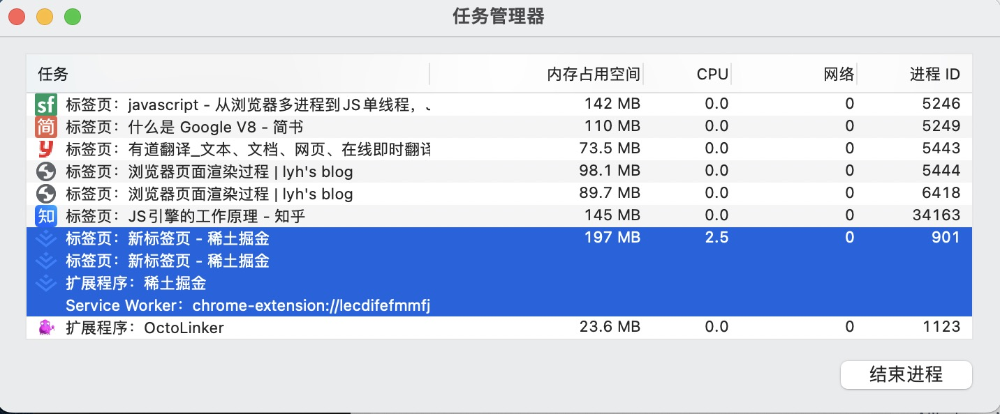

# 浏览器中的进程和线程（Chrome）

## 进程和线程的概念
- 进程是CPU分配的最小单元 (比如设备上每一个运行的app就是一个进程, 拥有独立的资源并且单独运行)
- 线程是CPU调度的最小单元 (线程是建立在进程基础上的一次程序运行单位，一个进程可以有多个线程，并且线程之间可以共享资源)
- 不同进程之间可以使用IPC （Inter Process Communication）进行通信

通俗一点，我们可以把进程理解为一家公司，线程则是公司里面的员工，可以单独做一件事情，也可以一起去做一件事情。

## 浏览器中的进程

- 浏览器能独立运行是因为系统给它单独分配了CPU和内存
- 浏览器是多进程的
- 每打开一个tab就会创建一个独立的进程（某些情况下会合并，比如打开多个空标签）

例如打开 谷歌浏览器-更多工具-任务管理器时，我们可以看到：

每一个tab是一个独立的进程，所以当该tab下出现异常，并不会影响其他tab的正常运行。

## 浏览器有哪些进程

怎么去理解浏览器有哪些进程呢，我们先来分析一下浏览器的功能并思考一下：
1. 浏览器输入网址打开页面，浏览器前进后退，书签栏这是浏览器的基本功能
2. 输入网址后，打开页面，页面渲染出来
3. 如果页面渲染是3D视图
4. 如果这个网页里面有视频或者音乐，那这个网页还需要可以播放出来才行
5. 以谷歌浏览器为例，我们还能安装一些广告过滤插件，调试工具插件
6. ....

根据浏览器本身的功能需求分析，我们可以得到：
1. 浏览器进程：主要负责界面显示、用户交互、子进程管理，同时提供存储等功能
2. 渲染进程：主要的作用为页面渲染，脚本执行，事件处理
3. 网络进程：主要负责页面的网络资源加载，之前是作为一个模块运行在浏览器进程里面，现在独立开来，成为一个单独的进程
4. GPU线程：用于3D绘制等，将开启了3D绘制的元素的渲染由CPU转向GPU，也就是开启GPU加速
5. 插件进程：每一个插件对应一个进程，在使用该插件时创建该进程
6. 音频进程：浏览器的音频管理

所以打开一个页面，至少需要使用到 浏览器进程，渲染进程，网络进程（本地路径访问静态页面不需要），而根据根据页面的css是否开启3D渲染去创建GPU线程，根据浏览器是否使用插件去创建插件进程，根据页面是否播放音频或者视频去创建音频现场。

## 多进程架构的好处
1. 某一个渲染进程出现问题不会影响其他正常运行。
2. 避免第三方插件奔溃影响浏览器
3. 多进程充分利用多核优势
4. 方便使用沙盒模型隔离插件等进程，提高浏览器安全和稳定性

## 浏览器中的线程

线程主要存在于渲染进程里面，也就是平时常说的浏览器内核，浏览器内核中的几种引擎就是平时主要使用到的线程，主要包括：

1. GUI渲染线程
- 负责渲染浏览器界面，解析HTML，CSS，构建DOM树和RenderObject树，布局和绘制
- 当界面需要重绘或者回流的时候，该线程就会执行
- 和JS引擎线程互斥，当执行JS引擎线程的时候，GUI会pending，当任务队列空闲时，才会继续执行GUI
> 由于JavaScript是可操纵DOM的，如果在修改这些元素属性同时渲染界面（即JS线程和UI线程同时运行），那么渲染线程前后获得的元素数据就可能不一致了。
> 因此为了防止渲染出现不可预期的结果，浏览器设置GUI渲染线程与JS引擎为互斥的关系，当JS引擎执行时GUI线程会被挂起， GUI更新则会被保存在一个队列中等到JS引擎线程空闲时立即被执行

2. JS引擎线程
- JS内核，负责解析处理JavaScript脚本程序，运行代码
- 浏览器无论什么时候都只有一个JS线程在运行程序
> JS代码可以修改DOM结构，如果JS是多线程的，当不同JS线程可能同时修改DOM结构，比如一个修改一个删除会有冲突，JS设计成单线程可以避免DOM渲染冲突。
> Webwork支持多线程，但是子线程受主线程控制并且不能访问DOM。

3. 事件触发线程
- 主要用来控制事件循环，主要包括微任务和宏任务，当对应的事件符合触发条件被触发时，该线程会把事件添加到待处理队列的末尾，等待JS引擎处理
- 由于JS引擎单线程的原因，所以待处理队列的事情都需要等待JS引擎空闲才会执行

4. 定时器触发线程
- setInterval、setTimeOut触发该线程
- 计时完毕后添加到事件队列，等待JS引擎线程空闲后执行
- setTimeOut需要注意
    1. 如果设置的timeout小于0，则设置为0
    2. 如果嵌套的层级超过了 5 层，并且 timeout 小于 4ms，则设置 timeout 为 4ms（W3C在[HTML标准](https://html.spec.whatwg.org/multipage/timers-and-user-prompts.html#dom-settimeout)中规定要求setTimeOut中低于4ms的时间间隔为4ms）
    > 循环嵌套的时候，如果浏览器允许0ms，可能会导致JS引擎不断被唤醒，从而引起event loop阻塞，导致页面没有响应

5. 异步HTTP请求线程
- XMLHttpRequest在连接后是通过浏览器新开一个线程请求
- 在检测到状态变更的时候，如果设置有回调函数，异步线程就会产生状态变更事件，将这个回调放入到事件队列中，再有JavaScript引擎执行。

## 浏览器进程和渲染线程（浏览器内核）的通信过程

1. 浏览器进程收到用户请求，首先需要获取页面内容（比如通过网络下载资源），随后将该任务通过 rendererHost 接口传递给render进程
2. render进程的rennderer接口收到消息，简单解释后，交给渲染线程，然后开始渲染
    - 渲染线程接收请求，加载网页并渲染网页，中间需要浏览器进程获取资源，可能需要GPU进程帮助渲染
    - 可能有js线程操作dom
    - render进程将结果传递给浏览器进程
3. 浏览器进程接收到结果并将结果绘制出来

