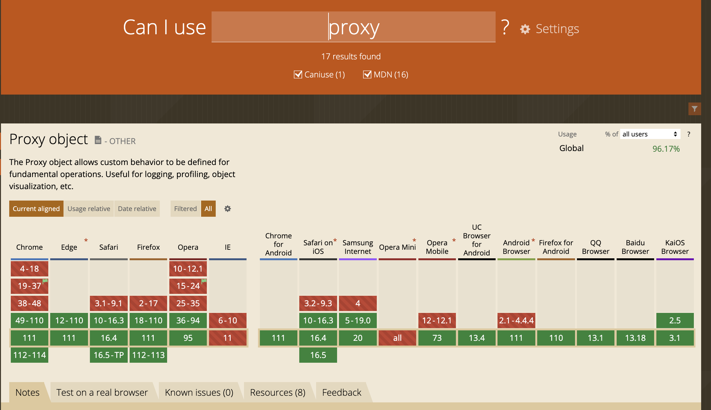

# vue的响应式

## 响应式对象
### vue2.x Object.defineProperty
> Object.defineProperty() 方法会直接在一个对象上定义一个新属性，或者修改一个对象的现有属性，并返回此对象

示例，[点这个看该函数详细文档](https://developer.mozilla.org/zh-CN/docs/Web/JavaScript/Reference/Global_Objects/Object/defineProperty)：
```
**
* obj 要定义的属性对象
* prop 要定义或者修改的属性
* descriptor 要定义或修改的属性描述符
* @return obj(被传递给函数的对象)
**
Object.defineProperty(obj, prop, descriptor)
```

#### 对象的属性
在javascript中，对象的属性分为两种类型：
- 数据属性：包含的是一个数据值的位置，在这可以对数据值进行读写
- 访问器属性：不包含数据值，包含的是一对get和set方法，在读取访问器属性时，在读取访问器属性时，会调用 getter 函数，这个函数负责返回有效的值；在写入访问器属性时，会调用 setter 并传入新值，这个函数负责决定如何处理数据

这两种属性都是对象，它们共享以下可选键值（默认值是指在使用 Object.defineProperty() 定义属性时的默认值）：
- configurable：当且仅当该属性的 configurable 键值为 true 时，该属性的描述符才能够被改变，同时该属性也能从对应的对象上被删除。 默认为 false
- enumerable：当且仅当该属性的 enumerable 键值为 true 时，该属性才会出现在对象的枚举属性中。 默认为 false
- writable：当且仅当该属性的 writable 键值为 true 时，属性的值，也就是上面的 value，才能被赋值运算符 (en-US)改变。 默认为 false
- value：该属性对应的值。可以是任何有效的 JavaScript 值（数值，对象，函数等）。 默认为 undefined
- get：在读取属性时调用的函数，默认为undefined
- set：在写入属性时调用的函数，默认值为undefined

描述符可拥有的键值：
|          | configurable | enumerable   | writable | value   | get | set  | 
| -------- | -----------  | --------     | -------- | ------- | --- |----- |
| 数据属性   | y           |           y   | y        | y       | n  | n     |
| 访问器属性 | y            |          y   | n        | n       | y   | y     |

#### 使用defineProperty
使用defineProperty去监听一个对象的属性变化：
```
const obj = { name: 'hi' }
var newName = obj.name
Object.defineProperty(obj, 'name', {
    get: function() {
        return newName
    },
    set: function(newVal) {
        console.log('name变化为', newName, '->', newVal);
        newName = newVal
    }
})

obj.name = 12 // console.log =>  name变化为 hi -> 12
```

由上我们可以去升级一下，模拟监听vue中的data：
```
const data = {
    name: 'vue',
    list: [1, 2, 3],
    options: {
        props: { value: 'attrs' },
        methods: {
            init: () => {},
            getData: () => {},
        }
    }
}

observe(data)

function observe (data) {
    if (!data || typeof data !== 'object') return
    Object.keys(data).forEach(key => {
        defineReactive(data, key, data[key])
    })
}

function defineReactive(obj, key, val) {
    observe(val)
    Object.defineProperty(obj, key, {
        get () {
            return val  
        },
        set (newVal) {
            console.log(key, '由', val ,'变化为', newVal)
            val = newVal
        }
    })
}

data.list[3] = 9 // 无consolo.log
data.list = [1, 2, 3, 4] // console.log => list 由 [1, 2, 3] 变化为 [1, 2, 3, 4]
data.name = 'vue3.0' // console.log => name 由 vue 变化为 vue3.0
data.newName = 'vue4.0' // 无consolo.log
```

从上面可以看到，通过defineProperty去循环对象，我们就实现了基本的数据绑定，但是同时也存在几个问题：
1. 数组的下标发生改变不会触发 defineProperty 的 set 方法
2. 对象新增的属性不会触发 defineProperty 的 set 方法

解决方案有：
1. 官方提供的 $set 方法，原理是会重新调用一遍 defineReactive 去监听 当前设置的 key
2. 重新设置 data 中的key，比如 data.list = [1, 2], 也会重新触发 defineReactive
3. vue3.0 通过proxy解决该问题

### vue3.x proxy
> Proxy 对象用于创建一个对象的代理，从而实现基本操作的拦截和自定义（如属性查找、赋值、枚举、函数调用等）

兼容性可以去[这里看看](https://caniuse.com/?search=proxy)：



示例，[点这个看该函数详细文档](https://developer.mozilla.org/zh-CN/docs/Web/JavaScript/Reference/Global_Objects/Proxy)：
```
/**
 * target 要使用 Proxy 包装的目标对象（可以是任何类型的对象，包括原生数组，函数，甚至另一个代理）
 * handler 一个通常以函数作为属性的对象，各属性中的函数分别定义了在执行各种操作时代理 p 的行为
 */
const p = new Proxy(target, handler)
```

handler 对象有许多方法，而set和get则可以满足对象的拦截：
```
// set

const p = new Proxy(target, {
    /**
     * target 目标对象
     * property 将被设置的属性名或 Symbol
     * value 新属性值
     * receiver 最初被调用的对象。通常是 proxy 本身，但 handler 的 set 方法也有可能在原型链上，或以其他方式被间接地调用（因此不一定是 proxy 本身）
     */
    set: function(target, property, value, receiver) {
    }
});

// get

const p = new Proxy(target, {
    /**
     * target 目标对象
     * property 将被设置的属性名或 Symbol
     * receiver 最初被调用的对象。通常是 proxy 本身，但 handler 的 set 方法也有可能在原型链上，或以其他方式被间接地调用（因此不一定是 proxy 本身）
     */
    set: function(target, property, receiver) {
    }
});
```

使用proxy来代理对象：
```
const obj = { num: 1, list: [1] }
const vm = new Proxy(obj, {
    get (target, key) {
        return target[key]
    },
    set (target, key, val) {
        console.log(key, '由', target[key] ,'变化为', val)
        target[key] = val
    }
})


vm.num = 2 // console.log => num 由 1 变化为 2
```

在这个基础上，我们去模拟一下监听vue3的data：
```
const obj = { num: 1, list: [1], info: { year: 2023, years: [2020, 2021] } }

const vm = defineReactive(obj)

function defineReactive(obj) {
    return new Proxy(obj, {
        get (target, key) {
            if (typeof target[key] === 'object') {
                return defineReactive(target[key])
            }
            return target[key]
        },
        set (target, key, val) {
            console.log(key, '由', target[key] ,'变化为', val)
            target[key] = val
        }
    })
    
}

vm.num = 2 // console.log => num 由 1 变化为 2
vm.list[1] = 2 // console.log => 1 由 undefined 变化为 2
vm.sum = 100 // console.log => sum 由 undefined 变化为 100
vm.info.year = 2024 // console.log => year 由 2023 变化为 2024
vm.info.years[2] = 2022 // console.log => 2 由 undefined 变化为 2022
```

#### 对比defineProperty
对比defineProperty，优势很明显的体现出来了：
1. 可以监听到新增加的对象属性
2. 可以监听到数组的新增
3. 实现代码简洁了很多

缺点：需要考虑兼容性

## 如何实现watch（vue2.x）
> watch 类型：{ [key: string]: string | Function | Object | Array }
```
/**
 * {string | Function} expOrFn
 * {Function | Object} callback
 * {deep: boolean, immediate: boolean} [options] 
 */
vm.$watch( expOrFn, callback, [options] )
```

官方示例：
```
watch: {
    a: function (val, oldVal) {
        console.log('new: %s, old: %s', val, oldVal)
    },
    // 方法名
    b: 'someMethod',
    // 该回调会在任何被侦听的对象的 property 改变时被调用，不论其被嵌套多深
    c: {
        handler: function (val, oldVal) { /* ... */ },
        deep: true
    },
    // 该回调将会在侦听开始之后被立即调用
    d: {
        handler: 'someMethod',
        immediate: true
    },
    // 你可以传入回调数组，它们会被逐一调用
    e: [
        'handle1',
        function handle2 (val, oldVal) { /* ... */ },
        {
        handler: function handle3 (val, oldVal) { /* ... */ },
        /* ... */
        }
    ],
    // watch vm.e.f's value: {g: 5}
    'e.f': function (val, oldVal) { /* ... */ }
}
```

先来分析一下在vue中watch实现了什么功能：
监听props，data（vue3.x中则是响应式数据），computed中的数据，当数据发生改变则会触发watch。
这个时候需要考虑几个问题：
1. 写在watch里面的属性才会被监听，那写在watch里面到底做了什么？
2. 数据发生改变，应该怎么去触发回调函数？


### 走进vue2.x 源码

#### 1. 初始化watch
代码在 **/src/core/instance/state.js**中的**initState**：
```
export function initState (vm: Component) {
  vm._watchers = []
  const opts = vm.$options
  if (opts.props) initProps(vm, opts.props)
  if (opts.methods) initMethods(vm, opts.methods)
  if (opts.data) {
    initData(vm)
  } else {
    observe(vm._data = {}, true /* asRootData */)
  }
  if (opts.computed) initComputed(vm, opts.computed)
  // export const nativeWatch = ({}).watch 需要考虑用户对 Object 进行操作
  if (opts.watch && opts.watch !== nativeWatch) {
    initWatch(vm, opts.watch)
  }
}

function initWatch (vm: Component, watch: Object) {
  for (const key in watch) {
    const handler = watch[key]
    if (Array.isArray(handler)) {
      for (let i = 0; i < handler.length; i++) {
        createWatcher(vm, key, handler[i])
      }
    } else {
      createWatcher(vm, key, handler)
    }
  }
}

function createWatcher (
  vm: Component,
  expOrFn: string | Function,
  handler: any,
  options?: Object
) {
  if (isPlainObject(handler)) {
    options = handler
    handler = handler.handler
  }
  if (typeof handler === 'string') {
    handler = vm[handler]
  }
  return vm.$watch(expOrFn, handler, options)
}

Vue.prototype.$watch = function (
    expOrFn: string | Function,
    cb: any,
    options?: Object
    ): Function {
    const vm: Component = this
    if (isPlainObject(cb)) {
        return createWatcher(vm, expOrFn, cb, options)
    }
    options = options || {}
    options.user = true
    const watcher = new Watcher(vm, expOrFn, cb, options)
    if (options.immediate) {
        const info = `callback for immediate watcher "${watcher.expression}"`
        pushTarget()
        invokeWithErrorHandling(cb, vm, [watcher.value], vm, info)
        popTarget()
    }
    return function unwatchFn () {
        watcher.teardown()
    }
}
```
上面代码做了这些事情：
1. 在initState中初始化watch，传入options中设置好的watch
2. 在initWatch中将每一个传入的watch进行createWatcher处理
3. 在createWatcher中，需要对是字符串或者对象的handler单独处理，然后调用vm.$watch进行监听。
4. 在$watch中主要做了这些：
    - 需要对是字符串或者对象的handler单独处理，通过createWatcher重新调用自身
    - 然后设置一个标记位options.user为true，表明这是一个user-watcher
    - 然后实例化watch
    - 判断是否需要初始执行，初始执行的场景下暂停dep收集，因为这个时候并不是由数据改变触发的watch，并添加异常处理
    - 调用 watcher.teardown() 移除当前订阅

#### 2. watch实现

```
let uid = 0

/**
 * A watcher parses an expression, collects dependencies,
 * and fires callback when the expression value changes.
 * This is used for both the $watch() api and directives.
 */
export default class Watcher {
  vm: Component; // 当前上下文
  expression: string; // 表达式
  cb: Function; // 回调函数
  id: number; //
  deep: boolean; // 是否深度监听
  user: boolean; // 标志位
  lazy: boolean; // computed中传入该参数
  sync: boolean; // 是否同步
  dirty: boolean; //
  active: boolean; // 是否处于激活状态
  deps: Array<Dep>; // 订阅列表
  newDeps: Array<Dep>; // 新订阅列表
  depIds: SimpleSet; // 订阅id设置
  newDepIds: SimpleSet; // 新订阅id设置
  before: ?Function; // 钩子
  getter: Function; // getter
  value: any; // watch返回的值

  constructor (
    vm: Component,
    expOrFn: string | Function,
    cb: Function,
    options?: ?Object,
    isRenderWatcher?: boolean
  ) {
    this.vm = vm
    if (isRenderWatcher) {
      vm._watcher = this
    }
    vm._watchers.push(this)
    // options
    if (options) {
      this.deep = !!options.deep
      this.user = !!options.user
      this.lazy = !!options.lazy
      this.sync = !!options.sync
      this.before = options.before
    } else {
      this.deep = this.user = this.lazy = this.sync = false
    }
    this.cb = cb
    this.id = ++uid // uid for batching
    this.active = true
    this.dirty = this.lazy // for lazy watchers
    this.deps = []
    this.newDeps = []
    this.depIds = new Set()
    this.newDepIds = new Set()
    this.expression = process.env.NODE_ENV !== 'production'
      ? expOrFn.toString()
      : ''
    // parse expression for getter
    if (typeof expOrFn === 'function') {
      this.getter = expOrFn
    } else {
      this.getter = parsePath(expOrFn)
      if (!this.getter) {
        this.getter = noop
        process.env.NODE_ENV !== 'production' && warn(
          `Failed watching path: "${expOrFn}" ` +
          'Watcher only accepts simple dot-delimited paths. ' +
          'For full control, use a function instead.',
          vm
        )
      }
    }
    this.value = this.lazy
      ? undefined
      : this.get()
  }

  /**
   * Evaluate the getter, and re-collect dependencies.
   */
  get () {
    pushTarget(this)
    let value
    const vm = this.vm
    try {
      value = this.getter.call(vm, vm)
    } catch (e) {
      if (this.user) {
        handleError(e, vm, `getter for watcher "${this.expression}"`)
      } else {
        throw e
      }
    } finally {
      // "touch" every property so they are all tracked as
      // dependencies for deep watching
      if (this.deep) {
        traverse(value)
      }
      popTarget()
      this.cleanupDeps()
    }
    return value
  }

  /**
   * Add a dependency to this directive.
   */
  addDep (dep: Dep) {
    const id = dep.id
    if (!this.newDepIds.has(id)) {
      this.newDepIds.add(id)
      this.newDeps.push(dep)
      if (!this.depIds.has(id)) {
        dep.addSub(this)
      }
    }
  }

  /**
   * Clean up for dependency collection.
   */
  cleanupDeps () {
    let i = this.deps.length
    while (i--) {
      const dep = this.deps[i]
      if (!this.newDepIds.has(dep.id)) {
        dep.removeSub(this)
      }
    }
    let tmp = this.depIds
    this.depIds = this.newDepIds
    this.newDepIds = tmp
    this.newDepIds.clear()
    tmp = this.deps
    this.deps = this.newDeps
    this.newDeps = tmp
    this.newDeps.length = 0
  }

  /**
   * Subscriber interface.
   * Will be called when a dependency changes.
   */
  update () {
    /* istanbul ignore else */
    if (this.lazy) {
      this.dirty = true
    } else if (this.sync) {
      this.run()
    } else {
      queueWatcher(this)
    }
  }

  /**
   * Scheduler job interface.
   * Will be called by the scheduler.
   */
  run () {
    if (this.active) {
      const value = this.get()
      if (
        value !== this.value ||
        // Deep watchers and watchers on Object/Arrays should fire even
        // when the value is the same, because the value may
        // have mutated.
        isObject(value) ||
        this.deep
      ) {
        // set new value
        const oldValue = this.value
        this.value = value
        if (this.user) {
          const info = `callback for watcher "${this.expression}"`
          invokeWithErrorHandling(this.cb, this.vm, [value, oldValue], this.vm, info)
        } else {
          this.cb.call(this.vm, value, oldValue)
        }
      }
    }
  }

  /**
   * Evaluate the value of the watcher.
   * This only gets called for lazy watchers.
   */
  evaluate () {
    this.value = this.get()
    this.dirty = false
  }

  /**
   * Depend on all deps collected by this watcher.
   */
  depend () {
    let i = this.deps.length
    while (i--) {
      this.deps[i].depend()
    }
  }

  /**
   * Remove self from all dependencies' subscriber list.
   */
  teardown () {
    if (this.active) {
      // remove self from vm's watcher list
      // this is a somewhat expensive operation so we skip it
      // if the vm is being destroyed.
      if (!this.vm._isBeingDestroyed) {
        remove(this.vm._watchers, this)
      }
      let i = this.deps.length
      while (i--) {
        this.deps[i].removeSub(this)
      }
      this.active = false
    }
  }
}
```


