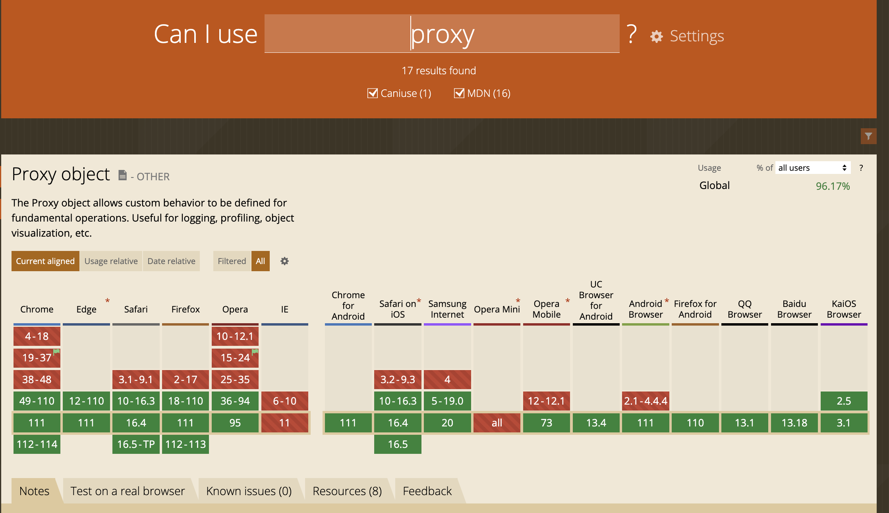

# vue的响应式（vue3.x）

## 响应式对象
### vue3.x proxy
> Proxy 对象用于创建一个对象的代理，从而实现基本操作的拦截和自定义（如属性查找、赋值、枚举、函数调用等）

兼容性可以去[这里看看](https://caniuse.com/?search=proxy)：



示例，[点这个看该函数详细文档](https://developer.mozilla.org/zh-CN/docs/Web/JavaScript/Reference/Global_Objects/Proxy)：
```
/**
 * target 要使用 Proxy 包装的目标对象（可以是任何类型的对象，包括原生数组，函数，甚至另一个代理）
 * handler 一个通常以函数作为属性的对象，各属性中的函数分别定义了在执行各种操作时代理 p 的行为
 */
const p = new Proxy(target, handler)
```

handler 对象有许多方法，而set和get则可以满足对象的拦截：
```
// set

const p = new Proxy(target, {
    /**
     * target 目标对象
     * property 将被设置的属性名或 Symbol
     * value 新属性值
     * receiver 最初被调用的对象。通常是 proxy 本身，但 handler 的 set 方法也有可能在原型链上，或以其他方式被间接地调用（因此不一定是 proxy 本身）
     */
    set: function(target, property, value, receiver) {
    }
});

// get

const p = new Proxy(target, {
    /**
     * target 目标对象
     * property 将被设置的属性名或 Symbol
     * receiver 最初被调用的对象。通常是 proxy 本身，但 handler 的 set 方法也有可能在原型链上，或以其他方式被间接地调用（因此不一定是 proxy 本身）
     */
    set: function(target, property, receiver) {
    }
});
```

使用proxy来代理对象：
```
const obj = { num: 1, list: [1] }
const vm = new Proxy(obj, {
    get (target, key) {
        return target[key]
    },
    set (target, key, val) {
        console.log(key, '由', target[key] ,'变化为', val)
        target[key] = val
    }
})


vm.num = 2 // console.log => num 由 1 变化为 2
```

在这个基础上，我们去模拟一下监听vue3的data：
```
const obj = { num: 1, list: [1], info: { year: 2023, years: [2020, 2021] } }

const vm = defineReactive(obj)

function defineReactive(obj) {
    return new Proxy(obj, {
        get (target, key) {
            if (typeof target[key] === 'object') {
                return defineReactive(target[key])
            }
            return target[key]
        },
        set (target, key, val) {
            console.log(key, '由', target[key] ,'变化为', val)
            target[key] = val
        }
    })

}

vm.num = 2 // console.log => num 由 1 变化为 2
vm.list[1] = 2 // console.log => 1 由 undefined 变化为 2
vm.sum = 100 // console.log => sum 由 undefined 变化为 100
vm.info.year = 2024 // console.log => year 由 2023 变化为 2024
vm.info.years[2] = 2022 // console.log => 2 由 undefined 变化为 2022
```

#### 对比defineProperty
对比defineProperty，优势很明显的体现出来了：
1. 可以监听到新增加的对象属性
2. 可以监听到数组的新增
3. 实现代码简洁了很多

缺点：需要考虑兼容性
